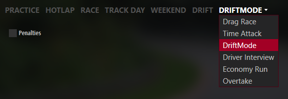

    </img>

# DriftMode for Assetto Corsa

Create your own drift courses and run them trying to maximize the score.

## Main features

- Drift course editor: zones, clips
- Sophisticated score calculation based on drift angle, speed and precision

https://github.com/Brewsk11/ac-drift-mode/assets/26325340/0502a5f8-488a-48d4-9d33-a98d9ef4d194

# User manual

## Prerequisites

* [Content Manager](https://assettocorsa.club/content-manager.html)
* [Custom Shaders Patch](https://acstuff.club/patch/) 0.2.11 or newer

## Installation

**Important note:** You cannot install the mod by drag & dropping into Content Manager

1. **Recommended:** If you are upgrading from older DriftMode versions, run `uninstall_driftmode.bat` from the Assetto Corsa installation directory.

2. Extract contents of `assettocorsa` directory into your Assetto Corsa installation directory.

    > For Steam version: `C:\Program Files (x86)\Steam\steamapps\common\assettocorsa`.
    >
    > To quickly open the directory, you can press `Win + R` and paste the path above.

## Setup

Before you run your first course, there are a few things that need to be done.

### Enable DriftMode

DriftMode installs as a custom mode available in the "Drive" tab in Content Manager:

### Car setup

Setting up car scoring points is manual and must be done for each car.

See the video for a general idea how to set the scoring points.

https://github.com/Brewsk11/ac-drift-mode/assets/26325340/2df856a9-367a-496c-b367-6dea2b6fe313

Automated car setup is planned.

### Choose or create a course

An example of a simple course created with the course editor:

https://github.com/Brewsk11/ac-drift-mode/assets/26325340/30485a49-ee03-4227-9167-17b53f55aa15

For more in-depth information see [Course editor manual](docs/course_editor.md).

### Teleport button

Usually courses feature a respawn line at the end of the course, however, for a quick restart there's an option to bind `Extra option F` in Content Manager to teleport on demand:

    Content Manager > Settings > Assetto Corsa > Controls > Patch > Car > Extra option F

## Play

To run a course the editor must be disabled.

### Scoring system

Each scoring object scores points differently, but in general score is calculated based on speed, angle and/or precision.

For more information about scoring elements see [Scoring objects](docs/scoring_elements.md).
