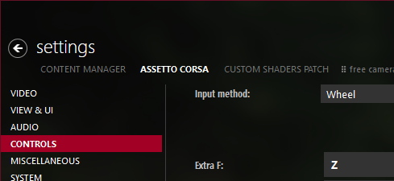

    </img>

# DriftMode for Assetto Corsa

A custom drift game mode for Assetto Corsa.

Create your own drift courses and run for highscores!

# Features

- Drift course editor: zones, clips
- Sophisticated score calculation based on drift angle, speed and precision

https://github.com/Brewsk11/ac-drift-mode/assets/26325340/0502a5f8-488a-48d4-9d33-a98d9ef4d194

# User manual

- [Course editor overview](./docs/course_editor.md)
- [Scoring system details](./docs/scoring_elements.md)

# Installation

## Prerequisites

* [Content Manager](https://assettocorsa.club/content-manager.html)
* [Custom Shaders Patch](https://acstuff.club/patch/) 0.2.11 or newer

## Install

> [!IMPORTANT]
> If you are upgrading from older DriftMode versions, run `uninstall_driftmode.bat` before reinstallation from the Assetto Corsa directory to ensure proper functionality.

Extract contents of `assettocorsa` directory into your Assetto Corsa installation directory.

For Steam version it is: `C:\Program Files (x86)\Steam\steamapps\common\assettocorsa`

# How to play

Before you run your first course, there are a few things that need to be done:

## Enable DriftMode

DriftMode installs as a custom mode available in the "Drive" tab in Content Manager:

## Car setup

Setting up car scoring points is manual and must be done for each car.

See the video for a general idea how to setup the car configuration.

https://github.com/Brewsk11/ac-drift-mode/assets/26325340/2df856a9-367a-496c-b367-6dea2b6fe313

Automated car setup is planned.

## Choose or create a course

> [!NOTE]
> Set the game-time to midnight for setup geometry to be more visible.

An example of a simple course created with the course editor:

https://github.com/Brewsk11/ac-drift-mode/assets/26325340/30485a49-ee03-4227-9167-17b53f55aa15

For more in-depth information see [Course editor manual](docs/course_editor.md).

## Teleporting to start

Courses can define a respawn line, which when crossed will teleport the player to the start position, however, for a quick restart there's an option to bind `Extra option F` in Content Manager to teleport on demand:

