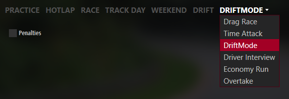

</img>

# Drift mode for Assetto Corsa

A custom game mode and course editor for scoring drift runs.

https://github.com/Brewsk11/ac-drift-mode/assets/26325340/0502a5f8-488a-48d4-9d33-a98d9ef4d194

# User manual

## Installation

Content Manager is highly recommended (seriously, please use it).

Custom Shaders Patch is required. This mod is developed on latest preview version of the Custom Shaders Patch. It is highly recommended to use latest preview versions.

**Important note:** You cannot install the mod by drag & dropping into Content Manager

1. **Recommended:** Extract `uninstall_driftmode.bat` into Assetto Corsa directory and run.

2. Extract contents of the archive into the Assetto Corsa directory; overwrite if asked.

## Setup

### Enable the DriftMode

Using latest CSP the option to choose custom modes is directly in the drive tab:

Older CSP have option to change to custom mode in settings.

### Set up the car

Using the app adjust points on the car bumpers.

These settings are needed for score calculations.

https://github.com/Brewsk11/ac-drift-mode/assets/26325340/2df856a9-367a-496c-b367-6dea2b6fe313

### Choose or create a course

Example of a simple course created with the course editor:

https://github.com/Brewsk11/ac-drift-mode/assets/26325340/30485a49-ee03-4227-9167-17b53f55aa15

Additionally, you may want to patch the track in the controls app. The patch enables extended physics which is needed for teleportation on the track and custom zone colliders. After patching restart the game.

Patched track may become incompatible with online play. To be able to play online again, unpatch the track.

### Start, finish and respawn line

**Start line** resets the score for the run.

**Finish line** shows scoring points in the zones. This is done after the run for performance reasons.

Crossing the **respawn line** will teleport to the starting point.

### Teleport button

    Content Manager > Settings > Assetto Corsa > Controls > Patch > Car > Extra option F

is used to manually teleport to the starting point of the course.

## Play

### Run the course

For now what course is active is chosen from the editor window.
Choose what you want to run and uncheck "enable editor".

Press the `Extra option F` button to respawn

### Scoring system

**Zones** are scored with the rear of the car. 
**Clips** are scored with the front of the car.

Score is calculated based on speed, angle or closeness to the outside wall for the zones or closeness to the origins of clipping points.
