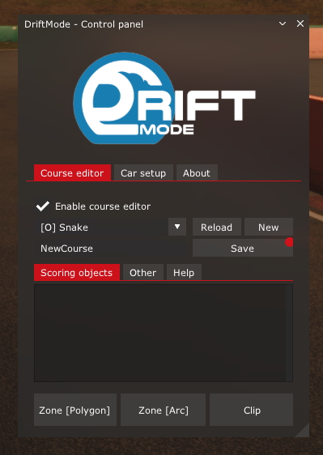
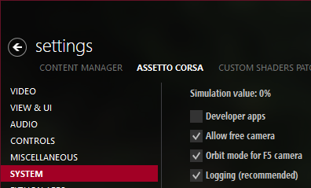
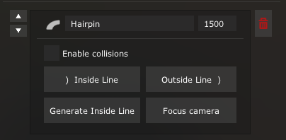
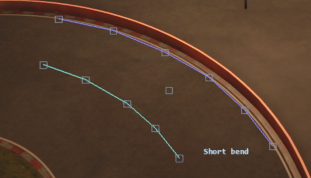
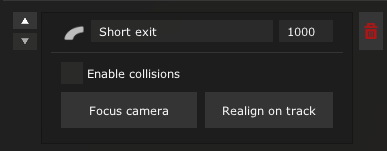
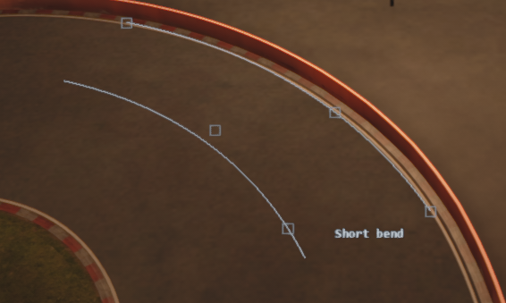
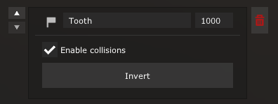
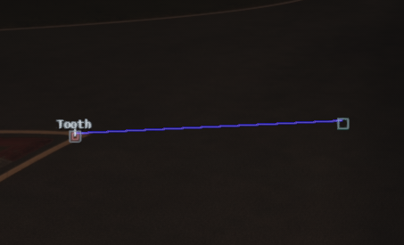
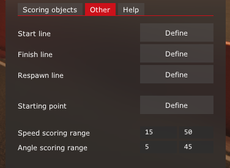
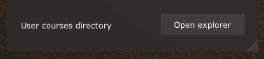

# DriftMode

> [!CAUTION]
> The following document is under construction.
> The information may be inaccurate and are subject to change.

## Control panel window

The course editor window is the main interface for creating courses.

## How to start

To create a new course click "New", change the name of the course and click "Save".

Courses can be created in outside car camera view, however it is highly recommended to be familiar with Assetto Corsa free camera controls.

To enable free camera tick this box in Content Manager settings:

Then, when in game, press F7.
More help can be found online.

The course elements can be moved around the track by dragging the gray square handles.
Holding CTRL and clicking on the handles will remove parts, or the entire objects.

## Scoring elements

These are course objects you can score points on.

Currently you can define zones and clips, but there are more scorable objects planned (such as a freestyle areas).

### Zone (by polygon)

> [!CAUTION]
> This is the legacy zone tool.
> Creating zone by arc is recommended.

To define a zone by polygon click the "Zone [Polygon]" button.
A new zone object will be created.

Hover over the zone in the editor and click "Outside line" button.
Then, by clicking on the track define an outside line for the zone.
Press right click to finish placing the points.

Click the "Inside line" button and do the same to define the inside line, or use "Generate inside line" feature to generate the points automatically.

> [!WARNING]
> Polygon zones with many defined points can worsen the performance.

The "Focus camera" button will move the free camera to above the zone for easier editing.

The "Enable collisions" checkbox will make the outside line of the zone impassable (a wall).

Correctly defined zone:

You can drag the all the square handles to modify the zone.
The center handle will move the whole zone.

### Zone (by arc)

To define a zone by arc click the "Zone [Arc]" button, then, click three times on the track to define points:
- where the outside line of the zone should start,
- where the outside line of the zone should end,
- a curve control point to define the zone shape.

The "Focus camera" button will move the free camera to above the zone for easier editing.

The "Enable collisions" checkbox will make the outside line of the zone impassable (a wall).

Correctly defined zone:

You can drag the all the square handles to modify the zone:
- handles on the outside line will change its shape,
- handle on the inside line will change the zone width,
- handle at the center will move the zone.

> [!TIP]
> Sometimes after moving the zone it gets skewed such that it's no longer parallel to the ground.
> In such case you can click the "Realign on track" to force the zone control points to lay flat on the ground.

### Clip

To define a clip, click the "Clip" button, then, click on track to define the clip origin (the bollard) and click again to define the direction of the clip.

The "Enable collisions" checkbox will make the clip's bollard a solid, impassable object.

The "Invert" button will swap the origin and end points.

## Other course elements

The course definition is made of scoring elements and other organizational elements defined in the "Other" tab:

### Starting position

This defines where and in which direction the car will respawn.

When setting it up click once the define the origin, and click again to define the direction.

### Start line

Crossing the start line resets the course score.

### Finish line

Finish line currently has no use.

In future releases straightening the car inbetween scoring elements will invalidate the score.
Passing the finish line will correctly finish the course and save the score.

### Respawn line

Crossing the respawn line will respawn the car to the start position or, if not set, the hotlap position.
Normally it should be defined a little after finish line.

It's not needed for course functionality, it just automates the process of going back to start.

## Sharing courses

To share a course you can click "Open explorer" in the "Other" tab:

Select and send the course file to a friend.

Your friend will need to click the same button and paste the course file on their computer.
